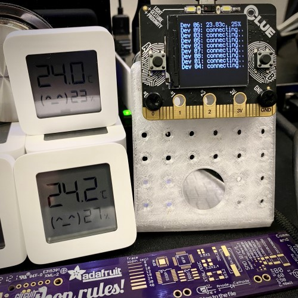

# `LYWSD03` Humidity Sensor Reading Experiments

Simple examples for reading data from `LYWSD03` devices.

The `code-address-finder.py` script makes it easy to power up devices one at a time to identify them and give them a nickname in the `addr.py` file.

Once `addr.py` is populated, the `code-device-reader.py` script will read the temp/humidity values from each device and display it.