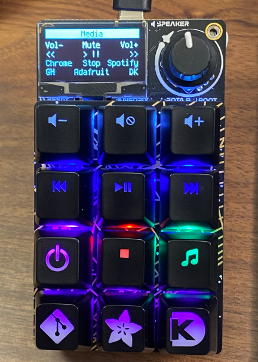

# `Macropad RP2040` Hotkey Configs for Learn Guide code

* Guide: <https://learn.adafruit.com/macropad-hotkeys/custom-configurations>
* Learn Guide Code: <https://github.com/adafruit/Adafruit_Learning_System_Guides/tree/main/Macropad_Hotkeys>

A collection of macro examples for use with the "Learn Guide" code that I've used on my Macropad for various scenarios.

## Macros: Windows 11

These macros all have media controls on the top part of the keypad and app/website links on the bottom keys.

The app/website macros all depend on pinned positions of apps, particularly Chrome, on the Windows 11 taskbar. Using this type of macro requires some wait time between operations, at least on my system, which is what `WIN_KEY_DELAY` is used for. Without that delay, apps with multiple windows open won't open their first window as expected. 

## Parts

Basics:

* Adafruit [`Macropad RP2040` kit](https://www.adafruit.com/product/5128)
* Adafruit [`Kailh Jade Thick Click Keyswitch`](https://www.adafruit.com/product/5149)
    * The reds in the kit are fine (and have found uses elsewhere) but I prefer the thicker ka-chunk of Cherry MX Greens. Unfortunately the greens are tough to find and, as far as I know, don't come with a white/clear housing - only the old Cherry classic black/black and black/clear if you can find them. These easily available Kailh Jades fit the bill quite nicely though, with a satisfying tactile click.
* Adafruit [`Mini Magnet Feet for RGB LED Matrices`](https://www.adafruit.com/product/4631)
    * These screw into the 3mm mount points on the corners of the Macropad are really handy for flexibly mounting the Macropad anywhere there's metal for it.

Selected Recommended/Cool Key Caps:

* Adafruit [`Etched Glow-Through Keycap with Digi-Key Logo`](https://www.adafruit.com/product/5143)
* Adafruit [`Etched Glow-Through Keycap with Adafruit Logo`](https://www.adafruit.com/product/5094)
* Adafruit [`Etched Glow-Through Keycap with Git Logo`](https://www.adafruit.com/product/5193)
* Adafruit [`Etched Glow-Through Keycap with Github Octocat Logo`](https://www.adafruit.com/product/5192)
* Adafruit [`Etched Glow-Through Keycap with Pull Request Logo`](https://www.adafruit.com/product/5196)
* Adafruit [`Etched Glow-Through Keycap with "wont fix" Text`](https://www.adafruit.com/product/5197)
* Adafruit [`Etched Glow-Through Keycap with "LGTM" (Looks Good to Me) Text`](https://www.adafruit.com/product/5195)
* Adafruit [`Etched Glow-Through Keycap with OSHW Gear Logo`](https://www.adafruit.com/product/5115)
* Adafruit [`Etched Glow-Through Keycap with Zener ESP Waves Design`](https://www.adafruit.com/product/5104)
* Adafruit [`Etched Glow-Through Keycap with Zener ESP Square Design`](https://www.adafruit.com/product/5106)
* Adafruit [`Etched Glow-Through Keycap with Zener ESP Star Design`](https://www.adafruit.com/product/5105)
* Adafruit [`Etched Glow-Through Keycap with Zener ESP Plus Design`](https://www.adafruit.com/product/5107)
* Adafruit [`Etched Glow-Through Keycap with Zener ESP Circle Design`](https://www.adafruit.com/product/5108)
* Adafruit [`Relegendable Plastic Keycaps`](https://www.adafruit.com/product/5039)
* Max Keyboard [`1x1 Media F-Key Shortcuts Keycap Set`](https://www.maxkeyboard.com/r4-1x1-media-f-key-shortcuts-keycap-set.html)
    * Glow-through media caps weren't easy to find but after a bit of Google searching I landed on these. The quality's good and they're exactly as advertised, although a bit pricey for a 'kit' where a few will end up unused in my projects.
* Max Keyboard [`R4 "Power" Backlight Cherry MX Keycap`](https://www.maxkeyboard.com/custom-r4-power-backlight-cherry-mx-keycap.html)
    * Just a nice, universal symbol to use for on/off, power, or other misc use cases

OLED and OLED FPC:

My OLED ended up with some heavy burn-in after I left it powered on with the same text for about six months. Whoops. Thankfully, Adafruit has a bunch of spares in stock!

OLED Datasheet: <https://cdn-shop.adafruit.com/product-files/5228/5223-ds.pdf>

* Adafruit [`Monochrome 1.3" 128x64 SH1106G SPI OLED Monochrome Display`](https://www.adafruit.com/product/5228)

It'd be nice to extend the FPC cable a bit to allow for mounting the FPC a bit higher up, like close to the surface of a case. I couldn't find any ready-made 'FPC extenders' for the job, but maybe DigiKey has some parts that could help get this done easily. Could either build an extender from connectors and a simple PCB or even just solder a short jumper to the connector. 

The FPC connector is 16-pin, 0.5mm pitch, 8.5mm (+- 0.07mm) wide, and 0.3mm (+- 0.03mm) thick.

Digikey FPC Connectors: <https://www.digikey.com/short/905db25d>
Digikey FPC Jumpers: <https://www.digikey.com/short/nvmb789r>