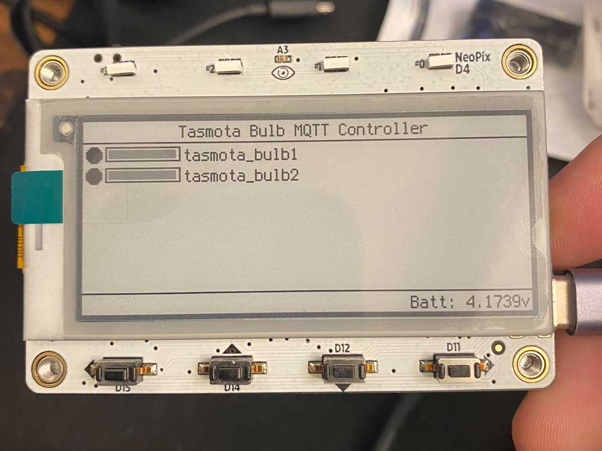

# `tasmota-tag`

Simple MagTag Tasmota bulb controller



## Setup

1. Set up [MagTag with CircuitPython 7.0+](https://learn.adafruit.com/adafruit-magtag/circuitpython)
2. Copy required CircuitPython libraries to MagTag in lib directory
    * `adafruit_bitmap_font`
    * `adafruit_display_shapes`
    * `adafruit_display_text`
    * `adafruit_logging.mpy`
    * `adafruit_minimqtt`
    * `adafruit_progressbar`
    * `adafruit_requests.mpy`
    * `neopixel.mpy`
3. Edit secrets.py in main directory with ssid and password for your wireless network
4. Edit secrets.py to include the IP, port, username, and password to use for your MQTT broker
5. Edit the bulbs list in secrets.py to contain the "names" (topic in Tasmota config parlance) for the bulbs you'd like to control
6. Copy code.py and secrets.py to the MagTag
7. Control those lightbulbs!

### `secrets.py`

The `secrets.py` file should contain the following data:

```py
secrets = {
    'ssid' : '<SSID_HERE>',
    'password' : '<PASSWORD_HERE>',
    'mqtt_broker': '<MQTT_BROKER_IP_HERE',
    'mqtt_port': 1883,
    'mqtt_user': '<MQTT_USER_HERE>',
    'mqtt_password': '<MQTT_PW_HERE',
    'bulbs': ["<TASMOTA_BULB_NAME>", "<TASMOTA_BULB2_NAME>"]
}
```

The list of bulbs should contain the **topic** of each bulb, which can be set (or found) in the Tasmota MQTT config page of the device.

### MQTT Setup

This script is built around the assumption that you're using the "Tasmota default" MQTT topic setup of `%prefix%/%topic%`.

### Tasmota Device Setup

This script is also built around the assumption that all of the devices have `SetOption59` enabled. This tells the device to send a `tele/%topic%/STATE` message after processing any incoming `POWER` or `light` command.

More info on `SetOption59` can be found in the [Tasmota Commands documentation](https://tasmota.github.io/docs/Commands/).

If you've followed the [Tasmota setup guide for Home Assistant](https://tasmota.github.io/docs/Home-Assistant/) this should already be done.

## Usage

On power up, the device will do the following.

* Connect to WiFi network in `secrets.py`
   * Neopixel 3 (the left-most pixel) is lit during WiFi connect
* Request state for the bulbs listed within the `secrets.py`
   * Neopixels 2 and 1 (the second-from-left and third-from-left pixels) are lit during MQTT setup and connect operations
   * Neopixel 1 will also be lit whenever user-initiated MQTT server operations are performed during loops
* Refresh the display to display the current state of the bulbs
   * Neopixel 0 (the right-most pixel) is lit during any status/display refresh operations
   * Neopixel 0 will also be lit whenever a display update is in progress during loops 
* Enter a loop for control/refresh

In the control/refresh loop the following user controls become available.

Note: MagTag buttons are A-D, starting at the left

* Button A (`D15`): Toggle power on all bulbs
* Button B (`D14`): Refresh display
* Button C (`D12`): Reduce brightness of all bulbs
* Button D (`D11`): Increase brightness of all bulbs

To avoid button-mashing creating MQTT server spam there's an input delay after each input that blocks input until the display refresh is complete, which usually takes 4-6 seconds or so. During this delay period the right-most Neopixel lights up to provide a visual indication that the tag is working on updating status and refreshing the display.

## Notes

This code was slapped together in a few hours of free time so please don't expect perfection. :) I just wanted to share the results of this experiment with the world before moving on to other fun things.

In particular there's a lot of code cleanup that needs to be done, particularly when it comes to power efficiency if running on battery. Could be a fun project for someone to tinker with someday. 

I tested this with two LED bulbs I recently flashed with Tasmota (a [Feit `OM100/RGBW/CA/AG`](https://templates.blakadder.com/feit_electric-OM100RGBWCAAG.html) and a [Novostella `UT55509`](https://templates.blakadder.com/novostella_UT55509.html)). It works just fine for turning the lights on and off and (roughly) controlling the brightness. These bulbs are running Tasmota [10.0.0 "Norman"](https://github.com/arendst/Tasmota/releases/tag/v10.0.0).

For the MQTT broker I'm just using a basic local server via the [Mosquitto Docker container](https://hub.docker.com/_/eclipse-mosquitto).

### Update: 2022/03/21

After using this code on a few MagTags for the last three months or so I noticed a few quirks during operation that required a bit of refactoring. 

* If the WiFi connection drops becomes less reliable the MQTT library may throw an unhandled "PINGRESP" exception that causes the loop to exit
    * Addressed this by wrapping all `client.loop()` calls with a try/except that tries reconnecting to WiFi and the MQTT server if an error occurs
* Bulb on/off and dimming status wasn't always accurate on display refresh
    * Added some logic to continue `client.loop()`ing if a new message was received until no new messages are left on the server
    * Added a var at the top of the file for `result_message_delay` to allow some time for the bulbs to respond to commands with a `RESULT` after commands
* A second tag connecting with the same client ID would result in the original tag being disconnected
    * Simply removed the custom "client ID" from the MQTT client setup, falling back on the random auto-generated name chosen by the client library.
* Delays after new inputs were getting annoying during daily use
    * Removed almost all of the `time.sleep()`s that had been sprinkled around to try and increase reliability of display updates
    * Improved and simplified both input handling and display updating

In addition to fixing those quirks I added `adafruit_logging` to the project and set up some custom loggers.

### Update: 2022/03/23

Several edge-case type issues were found during more testing that required rethinking how WiFi connectivity and MQTT broker connectivity were managed and retried on failure.

* Addressed Startup/Init Failures
  * Secrets file is not present, contains no data, or contains default/demo data
  * WiFi connect fails
  * MQTT broker connect fails
  * Initial `STATUS5`/`STATUS11` replies don't come in before display setup
* Addressed Loop failures
  * WiFi and/or MQTT server disconnect or become unreachable
  * Display update includes partially or fully outdated per-bulb data
* Minor Tweaks
  * Added setting of hostname based on WiFi adapter MAC address
  * Added debug information to display if debug logging is enabled
  * Initial structural prep for breaking complex parts out into their own classes
  * Log line, comment, readme cleanup

Addressing these was a fun experiment in creative error handling in Python, something I've only really done to this extent in Java. Thankfully the models are similar and, even more handy, CircuitPython/MicroPython maintain the functionality required to get things done well.

However, there was a lot of code added and shuffled around. As a result I've decided to maintain the "original", decidedly more simple, code in a different file - `tasmota-tag-code-v1.py`

## TODO

* Consolidate reused or complex code in discrete external classes
    * Any work in this direction should be done with the ultimate goal of creating one or more libraries or frameworks to accelerate and streamline similar projects in the future 
* Investigate conversion to use `alarm`/deep sleep to massively increase battery life
    * As it is now a fully-charged 420 mAh battery will drain in less than 18 hours. But with the power-saving features available on the MagTag and some refactoring battery life of days, weeks, or even months could likely be accomplished, making this a much more useful "set up and forget" device!
* Add a few easy-to-implement features for control/display of additional things
    * Add control of light color (RGB) and/or color temperature (CCT)
    * Add control or status display for other Tasmota device types, like switches (smart plugs, relays, etc.)
    * Add display of sensor data from MQTT and/or influxdb sources, like temp, humidity, etc.

## Ref Links

* <https://tasmota.github.io/docs/MQTT/>
* <https://tasmota.github.io/docs/Lights/>
* <https://learn.adafruit.com/mqtt-in-circuitpython/code-walkthrough>
* <https://learn.adafruit.com/mqtt-in-circuitpython/advanced-minimqtt-usage>
