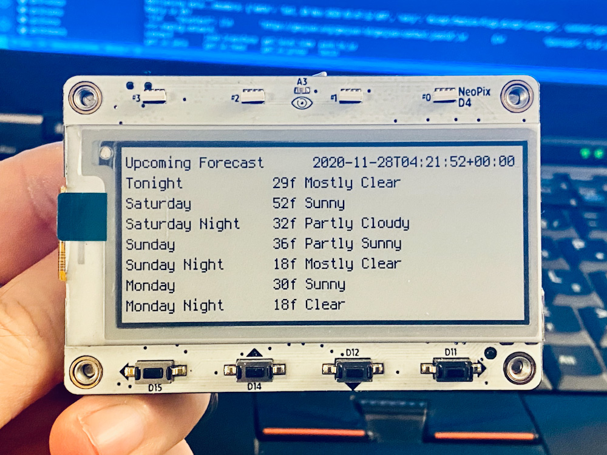

# `weather-tag`

Simple MagTag NWS weather forecast fetcher



## Overview

_NOTE: This was originally created on November 2020 using the latest CircuitPython and library versions available at the time. Since then a lot of progress has been made, including some relevant bugfixes and improvements, but this code hasn't (yet) been revisited to make use of these fancy new features. It might actually crash or do weird things for all I know so it may not be ready to run as-is_

This uses the US National Weather Service API to retrieve basic forecast data and displays it on the MagTag.

## Setup

Before getting started, you'll need to learn the "WFO" (weather forecast office) and "gridpoint" for the location you want forecasts for.

* See <https://www.weather.gov/srh/nwsoffices> to find the WFO for your location
* See <https://weather-gov.github.io/api/gridpoints> for more info on how to find the gridpoint for your location.

You'll need that information for step 4 when it comes time to create your `secrets.py`.

1. Set up MagTag with CircuitPython 6.x+
2. Copy required CircuitPython libraries to MagTag in `lib` directory
    * `adafruit_magtag`
    * `adafruit_bitmap_font`
    * `adafruit_display_text`
    * `adafruit_io`
    * `adafruit_requests.mpy`
    * `neopixel.mpy`
    * `simpleio.mpy`
3. Edit `secrets.py` in main directory with `ssid` and `password` for wireless network
4. Edit `secrets.py` to include the US NWS Weather Forecast Office and Gridpoint for forecast
5. Copy `code.py` and `secrets.py` to MagTag
6. Watch the magic happen :)

### `secrets.py`

The `secrets.py` file should contain the following data:

```py
secrets = {
    'ssid' : '<SSID_HERE>',
    'password' : '<PASSWORD_HERE>',
    'nws_wfo': 'MPX',
    'nws_gridpoint': '107,71'
    }
```

The `nws_wfo` and `nws_gridpoint` listed here are for my neighborhood in Minneapolis, MN. So if you'd prefer a forecast for a different area you should probably change those? :)

## Usage

On power up the device will do the following:

* Connect to WiFi network in `secrets.py`
* Acquire the latest NWS forecast for the NWS `gridpoint` defined in `secrets.py`
* Enter a loop for control/refresh

In the control/refresh loop the following user controls become available:

Note: MagTag buttons are A-D, starting at the left

* Button A (`D15`): Pull the latest forecast and refresh the display
* Button B (`D14`): Nothin'
* Button C (`D12`): Nothin'
* Button D (`D11`): Nothin'

## Notes

### MagTag Library Issues

_NOTE: Outdated! This issue was addressed in early 2021 by @makermelissa in the `portalbase` library by adding a new `add_json_content_type()` function! See the [issue](https://github.com/adafruit/Adafruit_CircuitPython_PortalBase/issues/3) and [pull request](https://github.com/adafruit/Adafruit_CircuitPython_PortalBase/pull/8) at `portalbase` for more details._

_Leaving the original note for now since I haven't revisited this code to make use of this fancy new function yet_

The MagTag library, like the PyPortal library, only does its own internal JSON parsing if it receives a `content-type` of `application/json` from the endpoint. This NWS endpoint returns `application/geo+json`, which means the MagTag lib skips past all of its JSON path harvesting magic, so we can't rely on the library's fancy features for request parsing.

## TODO

* Revisit code to make use of fancy features available in CircuitPython 7.x+ and newer versions of the `portalbase`/`magtag` libraries. 
* Convert to use of [`alarm`/deep sleep](https://circuitpython.readthedocs.io/en/latest/shared-bindings/alarm/index.html) instead of using a continuous loop to allow for long battery life.
    * Ideally this should only update once a day unless requested by a button press. Should be pretty easy to implement with a `time` and/or `pin` alarm, actually. :)